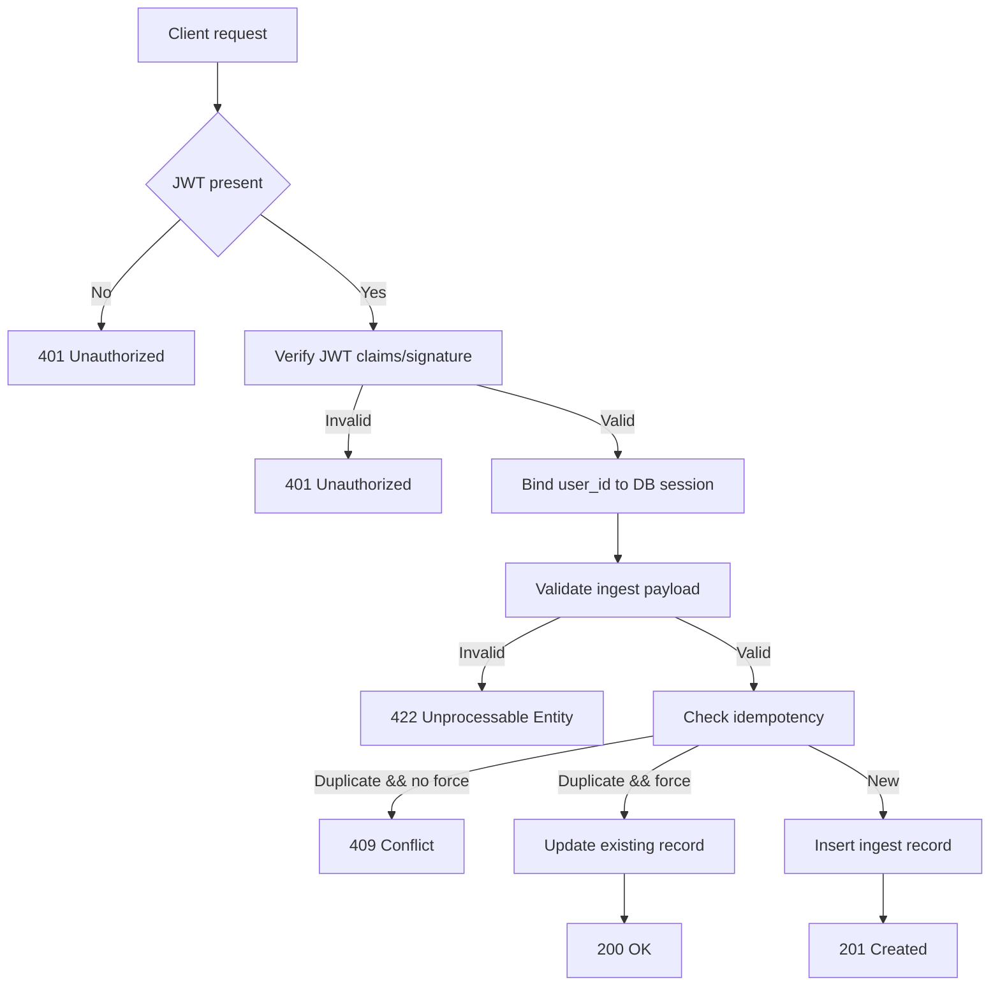

# [Spec Title: Ledger Auth + Ingest]

**Date**: 07/08/2026
**Last Update**: 07/08/2026
**Version**: 1.0
**Requester**: Project architecture / v3.0 spec
**Priority**: 🔴 HIGH

**Changelog v1.0**:

- Initial version

## Objective (Why)

Implement the first mandatory backend feature set for the Brazilian Financial Aggregator: secure JWT authentication, tenant-safe user context propagation, and canonical JSON ingest handling in the ledger service. This spec ensures the `ledger/` service can authenticate users, map JWT claims to PostgreSQL RLS context, and accept long-running ingest payloads with idempotency and strong validation before downstream analytics.

## Functional Description (What)

The `ledger/` service must expose secure endpoints for user registration, login, and authenticated ingestion of canonical monthly asset JSON data. Every request is authenticated via JWT; the backend extracts `user_id` from the token, binds it to DB session state, validates payloads against strict domain schemas, and persists ingest metadata and raw JSON for later reconciliation.

## Technical Flow

1. Client sends request with JWT access token in `Authorization: Bearer <token>`.
2. Go JWT middleware verifies the token signature, algorithm, expiration, and required claims (`user_id`, `email`, `role`).
3. Middleware stores authenticated user context in request scope and executes `SELECT set_config('app.current_user_id', $1, true)` in the database connection.
4. Ingest handler validates the canonical JSON payload structure for either `assets.json` or `movements.json` and checks `idempotency_key` uniqueness.
5. If valid, service persists ingest metadata and raw payload in `monthly_statements` within the same transaction.
6. On duplicate idempotency key, service returns existing record metadata unless `force_update=true`, in which case it updates the existing ingest entry and returns the latest state.

## Acceptance Criteria (Gherkin Style)

**Feature**: Ledger Auth + Ingest | **Effort**: Medium | **Risk**: Medium

- **Scenario**: Successful user login and ingest
  Given a registered user with valid credentials
  When the user posts to `/api/v1/portfolios/corretora-br/20260731/assets` with a valid JWT and canonical assets JSON payload
  Then the service returns `201 Created`
  And the database writes a staged ingest record linked to the authenticated `user_id`
  And the response includes ingest metadata and record identifier.

- **Scenario**: Missing or invalid token is rejected
  Given a request without `Authorization` or with an expired JWT
  When the user calls `/api/v1/portfolios/corretora-br/20260731/assets`
  Then the service returns `401 Unauthorized`
  And the request is not persisted.

- **Scenario**: Payload validation fails
  Given a request with malformed canonical JSON or missing required fields
  When the user calls `/api/v1/portfolios/corretora-br/20260731/mov`
  Then the service returns `422 Unprocessable Entity`
  And the response contains validation error details.

- **Scenario**: Duplicate idempotency key rejected
  Given a prior successful ingest with `idempotency_key` = `abc123`
  When the user calls `/api/v1/portfolios/corretora-br/20260731/assets` again with the same key and `force_update=false`
  Then the service returns `409 Conflict`
  And the response includes the existing ingest record metadata.

- **Scenario**: Force update on duplicate idempotency key
  Given a prior ingest exists with `idempotency_key` = `abc123`
  When the user calls `/api/v1/portfolios/corretora-br/20260731/assets` with the same key and `force_update=true`
  Then the service updates the existing ingest entry
  And the service returns `200 OK` with updated metadata.

## Technical Considerations

- **Endpoints/Events**:
  - `POST /api/v1/auth/register`
  - `POST /api/v1/auth/login`
  - `POST /api/v1/portfolios/{portfolio_name}/{YYYYMMDD}/assets`
  - `POST /api/v1/portfolios/{portfolio_name}/{YYYYMMDD}/mov`
  - `GET /api/v1/portfolios/{portfolio_name}/{YYYYMMDD}/reconciliation`
  - `POST /api/v1/portfolios/{portfolio_name}/{YYYYMMDD}/confirm`
  - `GET /api/v1/portfolios`
  - `POST /api/v1/portfolios`
  - `GET /api/v1/holdings`
  - `GET /api/v1/holdings/{id}/transactions`

- **Database**:
  - Tables: `users`, `monthly_statements`, `idempotency_keys`, `portfolios`, `holdings`, `transactions`.
  - Columns for `monthly_statements`: `id UUID PK`, `user_id UUID`, `portfolio_name TEXT`, `reference_date DATE`, `ingest_key TEXT`, `raw_payload JSONB`, `parsed_payload JSONB`, `status TEXT`, `submitted_at TIMESTAMPTZ`, `updated_at TIMESTAMPTZ`, `source TEXT`.
  - Columns for `idempotency_keys`: `key TEXT PK`, `user_id UUID`, `payload_hash TEXT`, `response_metadata JSONB`, `created_at TIMESTAMPTZ`, `updated_at TIMESTAMPTZ`.
  - Use `uuidv7()` and `now()` defaults.
  - Enforce unique constraint on `(user_id, portfolio_name, reference_date, ingest_key)` and `idempotency_keys.key`.

- **Cache/Queue**:
  - None required for initial ledger auth/ingest scope.
  - Downstream worker orchestration can use Redis or event queue later.

- **Security**:
  - JWT access tokens only; strict `alg` check and `kid` resolution if using JWK.
  - Secrets and DB connections through environment variables only (no hard-coded creds).
  - Passwords hashed by `bcrypt` or `argon2` in `ledger/auth`.
  - RLS policy based on session GUC `app.current_user_id` for tenant isolation.
  - Validate all incoming JSON to prevent schema injection and ensure typed fields.
  - Reject any request with missing claims, invalid audience, or malformed token.

- **Observability**:
  - Request/response logs for auth and ingest attempts.
  - Log result of JWT validation and RLS bind execution.
  - Metrics: `auth_success`, `auth_failure`, `ingest_success`, `ingest_validation_failure`, `ingest_idempotency_conflict`.
  - Distributed trace spans around token verification, DB bind, ingest validation, and persistence.

## Solution Design (Mermaid Diagram)

## Security Review

- OWASP Top 10 addressed:
  - Broken Access Control: represented by JWT auth + RLS per `user_id`.
  - Injection: mitigated by JSON schema validation and parameterized SQL.
  - Cryptographic Failures: no refresh tokens, strict JWT validation, env vars for secrets.
  - Security Misconfiguration: pinned runtime versions and explicit env var configuration.
  - Insufficient Logging and Monitoring: instrument auth/ingest events and failures.

- Secrets and connection strings MUST use environment variables. Example:
  - `LEDGER_DB_URL`
  - `JWT_SIGNING_KEY`
  - `REDIS_URL`

## Definition of Done (DoD)

- [ ] Auth middleware validates JWT and extracts `user_id`.
- [ ] Request context binds `user_id` into Postgres for RLS.
- [ ] `POST /api/v1/portfolios/{portfolio_name}/{YYYYMMDD}/assets` and `POST /api/v1/portfolios/{portfolio_name}/{YYYYMMDD}/mov` validate canonical JSON and store ingest records.
- [ ] Duplicate `idempotency_key` returns `409` unless `force_update=true`.
- [ ] All new DB schema delivered as `golang-migrate` SQL files.
- [ ] Unit and integration tests cover success and failure paths.
- [ ] Documentation updated in `docs/specs/20260807-ledger-auth-ingest_spec.md`.

## Verification Checklist

- [ ] Requirements validated against project macro and HTML spec.
- [ ] Existing contracts mapped for auth and ingest.
- [ ] No unvalidated assumptions remain in core login/ingest flow.
- [ ] Environment variables explicitly required for secrets/config.

## Next Step

After approval, execute `/plan` to generate the implementation plan and data model details. If there are open questions, I will refine this spec before moving to plan.
