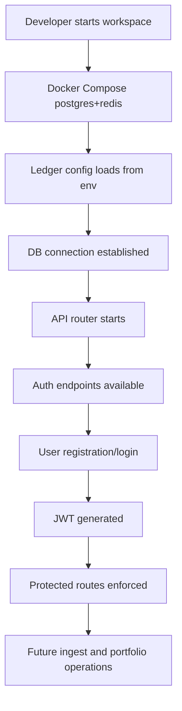

# [Spec Title: Ledger Scaffold, Infra, DB Migrations & Auth Bootstrap]

**Date**: 07/08/2026
**Last Update**: 07/08/2026
**Version**: 1.0
**Requester**: Project architecture / v3.0 spec
**Priority**: 🔴 HIGH

**Changelog v1.0**:

- Initial version covering S0 scaffold and S1 ledger auth/migration bootstrap.

## Objective (Why)

Complete the first two artifact stages for the Brazilian Financial Aggregator by delivering a production-ready ledger scaffold and the foundational backend platform.

Stage S0 delivers the workspace, dependency matrix, and local container infra for PostgreSQL and Redis. Stage S1 delivers the ledger core bootstrap: DB migrations, JWT-based auth, user registration/login, and protected routes for portfolio/holdings operations.

This specification aligns the implementation with the approved macro definition, artifact contract, and existing plan, ensuring the ledger codebase can compile independently and the database schema is versioned via `golang-migrate`.

## Functional Description (What)

The system must provide a developer-ready monorepo scaffold with a Go ledger service, PostgreSQL/Redis infra, and a baseline config model. The ledger service must support environment-driven configuration, authenticate users via JWT, bind authenticated user context into Postgres for tenant isolation, and manage initial database migrations for core domain entities.

S0 includes:

- `ledger/go.mod` with Go dependencies for `go-chi/chi`, `golang-jwt/jwt`, `pgx`, and cryptography
- `docker-compose.yml` with Postgres 18.4 and Redis 8.10.0 plus healthchecks
- `infra/.env.example` with required runtime variables

S1 includes:

- SQL migrations for `users`, `monthly_statements`, and `idempotency_keys`
- `ledger/internal/config` env-driven settings
- `ledger/internal/db` Postgres connection and transaction support
- `ledger/internal/auth` JWT claims, token generation/validation, password hashing
- `ledger/internal/handler` auth endpoints and protected API router
- `ledger/cmd/server/main.go` service bootstrap

## Technical Flow

1. Developer launches the workspace.
2. `docker compose up -d` starts PostgreSQL and Redis containers, verified by healthchecks.
3. Ledger config is loaded from environment variables and/or docker-linked Postgres values.
4. The ledger service connects to Postgres using `pgx` and validates connectivity.
5. The service exposes HTTP routes via `go-chi/chi`, including health, auth, and protected API groups.
6. User registration stores hashed passwords in `users`; login verifies credentials and returns a signed JWT.
7. Auth middleware extracts the Bearer token, validates claims and signature, and attaches `user_id` to request context.
8. Protected routes can later use the request context to bind `user_id` in DB transactions for RLS.

## Acceptance Criteria (Gherkin Style)

**Feature**: Ledger scaffold and auth bootstrap | **Effort**: Medium | **Risk**: Medium

- **Scenario**: Workspace and infrastructure bootstrapped successfully
  Given the repository contains `ledger/go.mod`, `docker-compose.yml`, and `infra/.env.example`
  When the developer runs `docker compose up -d`
  Then PostgreSQL 18.4 and Redis 8.10.0 start with healthy status
  And the ledger service can read environment config without hardcoded secrets.

- **Scenario**: Go ledger service compiles independently
  Given `ledger/go.mod` is present and dependencies are installed
  When the developer runs `go test ./...` inside `ledger/`
  Then the package compiles successfully with no build errors.

- **Scenario**: User can register and receive a JWT
  Given a valid email and password payload
  When the client posts to `POST /api/v1/auth/register`
  Then the service returns `201 Created`
  And the database stores the new user with a hashed password.

- **Scenario**: User can login and receive a valid access token
  Given a registered user and correct credentials
  When the client posts to `POST /api/v1/auth/login`
  Then the service returns `200 OK`
  And the response contains a signed JWT with `user_id`, `email`, and `role` claims.

- **Scenario**: Token validation protects routes
  Given a protected route under `/api/v1`
  When the request contains an invalid or missing Bearer token
  Then the service returns `401 Unauthorized`
  And the request does not proceed to the handler.

- **Scenario**: Core migrations exist and are reversible
  Given the `ledger/db/migrations/` directory
  When the developer runs `golang-migrate` up/down
  Then the `users`, `monthly_statements`, and `idempotency_keys` tables are created and dropped successfully.

## Technical Considerations

### Endpoints/Events

- `GET /health`
- `POST /api/v1/auth/register`
- `POST /api/v1/auth/login`
- `POST /api/v1/portfolios/{portfolio_name}/{YYYYMMDD}/assets`
- `POST /api/v1/portfolios/{portfolio_name}/{YYYYMMDD}/mov`
- `GET /api/v1/portfolios`
- `POST /api/v1/portfolios`
- `GET /api/v1/holdings`
- `GET /api/v1/holdings/{id}/transactions`

### Database

- `users`: `id UUID PK`, `email TEXT UNIQUE`, `password_hash TEXT`, `display_name TEXT`, `created_at TIMESTAMPTZ`
- `monthly_statements`: `id UUID PK`, `user_id UUID FK`, `portfolio_name TEXT`, `reference_date DATE`, `ingest_key TEXT`, `raw_payload JSONB`, `parsed_payload JSONB`, `status TEXT`, `source TEXT`, `submitted_at TIMESTAMPTZ`, `updated_at TIMESTAMPTZ`
- `idempotency_keys`: `key TEXT PK`, `user_id UUID FK`, `payload_hash TEXT`, `response_metadata JSONB`, `created_at TIMESTAMPTZ`, `updated_at TIMESTAMPTZ`
- Use `uuidv7()` defaults for UUID generation where available.
- Enforce unique constraint on `(user_id, portfolio_name, reference_date, ingest_key)`.

### Cache/Queue

- Redis is provisioned in S0 but not required for S1 implementation.
- Redis can be used later for auth session cache, rate limiting, or worker coordination.

### Security

- No hardcoded secrets; use env vars such as `LEDGER_DB_URL`, `JWT_SIGNING_KEY`, `JWT_ISSUER`, `POSTGRES_USER`, `POSTGRES_PASSWORD`, `POSTGRES_DB`, `REDIS_URL`, `LEDGER_PORT`.
- Passwords hashed with `bcrypt` or `argon2` before storage.
- JWT tokens validated with exact `alg` check for `HS256`.
- Protect all `/api/v1` routes with auth middleware.
- Prepare for RLS by binding `user_id` to DB sessions via `SET LOCAL app.current_user_id = $1` within transactions.

### Observability

- Log service startup and DB connectivity events.
- Log auth success and failure reasons at the middleware boundary.
- Log incoming request paths and response status codes via `chi` middleware.

## Solution Design

## Definition of Done (DoD)

- [ ] `ledger/go.mod` and `ledger/cmd/server/main.go` exist and compile.
- [ ] `docker-compose.yml` defines Postgres 18.4 and Redis 8.10.0 with healthchecks.
- [ ] `infra/.env.example` documents required runtime variables.
- [ ] `ledger/internal/config` loads environment settings.
- [ ] `ledger/internal/db` opens and verifies Postgres connectivity.
- [ ] `ledger/db/migrations/000001_create_users_table.*` exists.
- [ ] `ledger/db/migrations/000002_create_monthly_statements.*` exists.
- [ ] `ledger/db/migrations/000003_create_idempotency_keys.*` exists.
- [ ] `ledger/internal/auth` supports user registration, login, JWT generation, and token validation.
- [ ] Auth middleware protects routes and rejects invalid tokens.
- [ ] `go test ./...` passes within `ledger/`.
- [ ] Documentation updated in `docs/specs/20260807-ledger-s0-s1_spec.md`.

## Verification Checklist

- [ ] Macro definition exists in `docs/project/20260807-project_macro.md`.
- [ ] Current artifact steps S0 and S1 are covered by the spec.
- [ ] Existing implementation artifacts (`docker-compose.yml`, `ledger/go.mod`, `ledger/internal/*`, `ledger/db/migrations/*`) are aligned.
- [ ] No runtime secrets are hardcoded.
- [ ] Security and observability requirements are clearly documented.

## Notes

- This spec intentionally covers both S0 and S1 to bridge workspace scaffolding and ledger auth bootstrap.
- S0 is primarily infra and workspace readiness; S1 is initial ledger service behavior and schema migration ownership.
- Full user CRUD, ingest payload parsing, and reconciliation logic remain in later stages.
