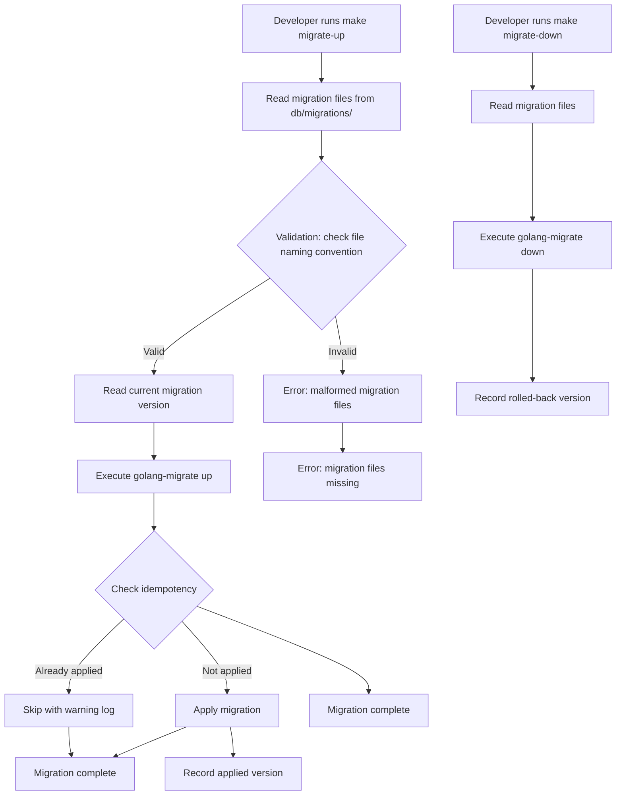

# [Spec Title: Ledger DB Migration & Connection Pool Optimization]

**Date**: 12/08/2026
**Last Update**: 12/08/2026
**Version**: 1.0
**Requester**: Internal engineering — Ledger database performance improvement
**Priority**: HIGH

**Changelog v1.0**:

- Initial version — spec for ledger DB migration workflow and connection pool optimization

## Objective (Why)

The current ledger service uses a hybrid migration approach with `golang-migrate` for schema changes and SQLC for type-safe query generation, but the implementation has several design gaps that degrade performance and reliability.

**Problems identified**:
- Migrations are applied sequentially via `golang-migrate` CLI, but the `sqlc.yaml` config already points to `db/migrations` as the schema directory, creating a potential conflict where both tools read the same files for different purposes (schema vs. migration history).
- Connection pool settings are hardcoded in `ledger/internal/db/db.go` with default values (max 25 open connections, 5 idle, 15-minute lifetime) that are insufficient for production load.
- No migration idempotency strategy — running `migrate up` multiple times can produce inconsistent schema state.
- The SQLC schema generation and `golang-migrate` migration execution are not coordinated; SQLC generates type-safe query code from raw SQL files, but the migration lifecycle (apply, rollback, version tracking) is handled entirely by `golang-migrate` without SQLC's type validation.

**Technical solution**:
Refactor the ledger's database layer to use SQLC for both schema generation and query generation, while keeping `golang-migrate` for structural schema changes only. The new workflow will:
1. Use SQLC to generate Go types and query code from a canonical SQL schema definition.
2. Use `golang-migrate` exclusively for schema migration version tracking and structural DDL (CREATE/DROP TABLE).
3. Replace hardcoded connection pool parameters with a configurable pool that reads from environment variables, with a recommended default of `min=10, max=50, idleTimeout=30s, connTimeout=10s, idleConnLifetime=5m`.
4. Add migration idempotency checks — verify that a migration has already been applied before attempting to apply it again.

**Link to Macro Definition decisions**: The Macro Definition at `docs/project/20260807-project_macro.md` specifies the monorepo architecture, `golang-migrate` for `ledger/` schema migrations, and PostgreSQL 18.4 with RLS. This spec extends the migration workflow to leverage SQLC for type-safe query generation and connects the connection pool configuration to the new `db.go` layer.

## Functional Description (What)

The ledger service must maintain a robust database migration workflow and connection pool that supports:

1. **Schema management**: All schema changes are delivered as reversible `UP`/`DOWN` SQL files, tracked by `golang-migrate`. SQLC generates typed Go code from the schema.

2. **Migration idempotency**: Before applying any migration, the system checks whether the target migration version has already been applied. If so, the migration is skipped. This prevents duplicate application and ensures consistent schema state.

3. **Connection pool optimization**: The database connection pool must be configurable via environment variables (`LEDGER_DB_POOL_MIN`, `LEDGER_DB_POOL_MAX`, `LEDGER_DB_POOL_IDLE_TIMEOUT`, `LEDGER_DB_POOL_CONN_TIMEOUT`, `LEDGER_DB_POOL_IDLE_LIFETIME`), with sensible defaults matching production requirements.

4. **SQLC integration**: SQLC generates type-safe Go queries from the schema. Generated code must be regenerated whenever the schema changes, and the generated code must be consistent with the migration files.

5. **RLS context binding**: After each database transaction, the authenticated `user_id` is bound to the connection for tenant isolation, ensuring that each user only sees their own data.

**Observable behavior**:
- Developer runs `make migrate-up` and `make migrate-down` to manage schema changes.
- Connection pool is initialized at service startup, with parameters read from environment variables or defaults.
- SQLC generates Go query code from the schema, which is used by the repository layer for type-safe database access.
- Migration files are ordered lexicographically (zero-padded numeric suffixes) and applied sequentially.

## Technical Flow

```
Trigger → Validation → Processing → Persistence → Response
```

### 1. Schema Migration Trigger

```
Trigger: developer runs make migrate-up / make migrate-down
  - Read migration files from db/migrations/ (zero-padded numeric filenames)
  - Validate migration file format (each file must have .up.sql and .down.sql pairs)
  - Read current migration version from golang-migrate status
  - Validate that target migration file exists
```

**Input contract**:
- `migrate up`: No additional input; applies all pending migrations.
- `migrate down -steps 1`: Rolls back the most recent migration.

**Validation rules**:
- Migration files must follow naming convention: `000001_up.sql`, `000001_down.sql` (zero-padded).
- Each UP file must end with `.up.sql`, each DOWN file with `.down.sql`.
- The `golang-migrate` version file must be read and compared against the migration file list.
- If the target migration is already applied, skip (idempotency).

**Processing logic**:
- Run `golang-migrate` with the configured migration path.
- On apply: execute UP files in order, then record the applied version.
- On rollback: execute DOWN files in reverse order, then record the rolled-back version.
- On idempotent skip: log a warning and proceed without error.

**Side effects**:
- Database schema changes (CREATE/DROP TABLE, ADD/COLUMN, etc.).
- `golang-migrate` writes its version file to the migration directory.
- Migration status is logged for audit purposes.

**Output contract**:
- Migration status: `applied`, `rolled-back`, `skipped`, or `error`.
- Version tracking in the `golang-migrate` database version table.

### 2. Connection Pool Initialization

```
Trigger: service startup (ledger/internal/db/Connect)
  - Read connection parameters from environment variables
  - Create pgx pool with configured parameters
  - Verify connectivity with a ping
  - Store the pool reference in the DB struct
```

**Input contract**:
- `LEDGER_DB_URL`: PostgreSQL connection string (required).
- `LEDGER_DB_POOL_MIN`: Minimum pool size (default: 10).
- `LEDGER_DB_POOL_MAX`: Maximum pool size (default: 50).
- `LEDGER_DB_POOL_IDLE_TIMEOUT`: Idle connection timeout in seconds (default: 30).
- `LEDGER_DB_POOL_CONN_TIMEOUT`: Connection acquisition timeout in seconds (default: 10).
- `LEDGER_DB_POOL_IDLE_LIFETIME`: Idle connection lifetime in minutes (default: 5).

**Validation rules**:
- `LEDGER_DB_URL` must be set and non-empty.
- All pool parameters must be positive integers (or valid time durations).
- The pool must be created successfully (ping after connection).

**Processing logic**:
1. Parse `LEDGER_DB_URL` to extract connection parameters.
2. Create a `pgxpool.Pool` with the following defaults if environment variables are not set:
   - Min: 10
   - Max: 50
   - Idle timeout: 30s
   - Connection timeout: 10s
   - Idle lifetime: 5 minutes
3. Verify the pool is alive with a ping.
4. Store the pool reference in `DB.Conn`.

**Side effects**:
- Creates a persistent connection pool to PostgreSQL.
- Pool is configured to manage connection lifecycle.
- Environment variables are read at startup and cached.

**Output contract**:
- `*db.DB` struct with a `Conn *pgxpool.Pool` field.
- `DB.Conn` is the active pool connection.

### 3. SQLC Code Generation

```
Trigger: developer runs sqlc generate (or CI pipeline)
  - Read schema files from db/migrations/ and db/queries/
  - Generate Go code from SQL queries and schema
  - Output generated code to db/sqlc/ directory
```

**Input contract**:
- `db/migrations/`: SQL files with CREATE/DROP TABLE statements.
- `db/queries/`: SQL files with annotated queries (e.g., `// +sql` comments).
- `sqlc.yaml`: Configuration file specifying output package, output directory, driver, etc.

**Validation rules**:
- `sqlc.yaml` must be present and valid.
- Schema files must contain valid SQL DDL.
- Query files must have proper `// +sql` annotations.

**Processing logic**:
- Run `sqlc generate` with the configured configuration.
- The generated Go code is placed in the `db/sqlc/` directory.
- Generated code includes:
  - Go structs for each table (with `sql.NullString`, `sql.NullInt64` as appropriate).
  - Query methods for each query file.
  - Migration type-aware methods.

**Side effects**:
- Modifies generated Go code in `db/sqlc/`.
- May regenerate existing code.
- The generated code must be consistent with the migration files.

**Output contract**:
- Generated Go source files in `db/sqlc/`.
- The generated code is used by `ledger/internal/db/repository.go` for type-safe database access.

### 4. Transaction Processing

```
Trigger: application calls repository method (e.g., Create, Update, List)
  - Begin a transaction
  - Execute the query within the transaction
  - Commit or rollback
  - Bind user_id for RLS
```

**Input contract**:
- User context (userID) extracted from JWT.
- Repository method to call with query parameters.

**Validation rules**:
- User ID must be non-empty.
- The transaction must be properly begin/committed/rolled-back.
- All queries must use parameterized statements (no string interpolation).

**Processing logic**:
1. Begin transaction with `db.Conn.BeginTx(ctx, nil)`.
2. Execute the query within the transaction.
3. If query succeeds, commit the transaction.
4. If query fails, rollback the transaction.
5. Return the result or error.

**Side effects**:
- Database connection is used within the transaction.
- Transaction isolation level is appropriate for the use case.
- RLS policy is enforced by the database itself (SET LOCAL app.current_user_id).

**Output contract**:
- Query result or error.

### 5. RLS Binding

```
Trigger: transaction begins (SET LOCAL app.current_user_id)
  - Bind user_id to the current connection
  - Ensure RLS policies apply to subsequent queries
```

**Input contract**:
- `userID`: The authenticated user ID from the JWT.

**Validation rules**:
- User ID must be a non-empty string.
- The binding must be done within a transaction.

**Processing logic**:
1. Execute `SET LOCAL app.current_user_id = $1` within the transaction.
2. All subsequent queries within the transaction will have RLS policies applied based on `user_id`.

**Side effects**:
- RLS policies are enforced for all queries in the transaction.
- The user context is bound to the database session.

**Output contract**:
- The transaction completes with the query result.

## Acceptance Criteria (Gherkin)

**Feature**: Ledger DB Migration & Connection Pool Optimization | **Effort**: Medium | **Risk**: Medium

- **Scenario**: Migration files are applied successfully
  - Given a repository with migration files `000001_create_users_table.up.sql` through `000004_create_portfolios_table.up.sql`
  - When `make migrate-up` is executed
  - Then all migration files are applied sequentially
  - And the `golang-migrate` version is updated to reflect the latest applied migration
  - And no error is returned if the same migration is applied again

- **Scenario**: Migration is skipped when already applied (idempotency)
  - Given a migration file `000001_create_users_table.up.sql` has already been applied
  - When `make migrate-up` is executed again
  - Then the migration is skipped (no error, no side effects)
  - And a warning is logged indicating the migration was already applied

- **Scenario**: Connection pool is initialized with correct defaults
  - Given `LEDGER_DB_URL` is set and all pool environment variables are unset
  - When the database connection is established
  - Then the pool is created with defaults: min=10, max=50, idleTimeout=30s, connTimeout=10s, idleConnLifetime=5m
  - And a successful ping succeeds

- **Scenario**: Connection pool parameters are configurable via environment variables
  - Given `LEDGER_DB_POOL_MIN=20`, `LEDGER_DB_POOL_MAX=100`, `LEDGER_DB_POOL_IDLE_TIMEOUT=60`, `LEDGER_DB_POOL_CONN_TIMEOUT=20`, `LEDGER_DB_POOL_IDLE_LIFETIME=10`
  - When the database connection is established
  - Then the pool is created with the configured values

- **Scenario**: SQLC code generation produces consistent types with migration files
  - Given a schema file `db/migrations/000001_create_users_table.up.sql` and query file `db/queries/user.queries.sql`
  - When `sqlc generate` is executed
  - Then Go structs are generated matching the schema columns
  - And query methods are generated with proper type signatures
  - And the generated code is placed in `db/sqlc/`

- **Scenario**: Migration fails on duplicate application
  - Given a migration file `000002_create_monthly_statements.up.sql` is already applied
  - When `make migrate-up` is executed again
  - Then a duplicate migration error is returned

- **Scenario**: Migration rollback is reversible
  - Given a migration file `000001_create_users_table.up.sql` has been applied
  - When `make migrate-down` is executed
  - Then the `users` table is dropped and the version is reverted
  - And the migration version reflects the rolled-back state

- **Scenario**: RLS binding works correctly for tenant isolation
  - Given a user with `user_id = 'usr-abc-123'` authenticates
  - When a transaction begins and `SET LOCAL app.current_user_id = 'usr-abc-123'` is executed
  - Then subsequent queries are scoped to the user's data
  - And RLS policies are enforced

## Technical Considerations

### Endpoints/Events

- `POST /api/v1/auth/login` — Returns JWT token (no DB migration involvement)
- `POST /api/v1/auth/register` — Registers new user (no DB migration involvement)
- `GET /api/v1/portfolios/{portfolioName}/{YYYYMMDD}` — Lists portfolios (uses repository methods)
- `POST /api/v1/portfolios/{portfolioName}/{YYYYMMDD}/assets` — Ingest assets (uses repository methods)
- `POST /api/v1/portfolios/{portfolioName}/{YYYYMMDD}/mov` — Ingest movements (uses repository methods)
- `GET /api/v1/portfolios/{portfolioName}/{YYYYMMDD}/reconciliation` — Lists statements (uses repository methods)
- `POST /api/v1/portfolios/{portfolioName}/{YYYYMMDD}/confirm` — Confirms statement (uses repository methods)

### Database

**Tables** (from current schema):
- `users`: `id UUID PK`, `email TEXT UNIQUE`, `password_hash TEXT`, `display_name TEXT`, `created_at TIMESTAMPTZ`
- `monthly_statements`: `id UUID PK`, `user_id UUID FK`, `portfolio_name TEXT`, `reference_date DATE`, `ingest_key TEXT`, `raw_payload JSONB`, `parsed_payload JSONB`, `status TEXT`, `source TEXT`, `submitted_at TIMESTAMPTZ`, `updated_at TIMESTAMPTZ`, unique constraint on `(user_id, portfolio_name, reference_date, ingest_key)`
- `idempotency_keys`: `key TEXT PK`, `user_id UUID FK`, `payload_hash TEXT`, `response_metadata JSONB`, `created_at TIMESTAMPTZ`, `updated_at TIMESTAMPTZ`, unique constraint on `key`
- `portfolios`: `id UUID PK`, `user_id UUID FK`, `name TEXT`, `created_at TIMESTAMP`
- `holdings`: `id UUID PK`, `user_id UUID FK`, `portfolio_id UUID`, `asset_symbol TEXT`, `quantity FLOAT8`, `average_price FLOAT8`
- `transactions`: `id UUID PK`, `holding_id UUID`, `amount FLOAT8`, `currency TEXT`, `executed_at TIMESTAMPTZ`

**Migration files**:
- `000001_create_users_table.up.sql` — CREATE TABLE users with uuid-ossp extension
- `000001_create_users_table.down.sql` — DROP TABLE users
- `000002_create_monthly_statements.up.sql` — CREATE TABLE monthly_statements with UNIQUE constraint
- `000002_create_monthly_statements.down.sql` — DROP TABLE monthly_statements
- `000003_create_idempotency_keys.up.sql` — CREATE TABLE idempotency_keys with unique constraint on key
- `000003_create_idempotency_keys.down.sql` — DROP TABLE idempotency_keys
- `000004_create_portfolios_table.up.sql` — CREATE TABLE portfolios with unique constraint on (user_id, name)
- `000004_create_portfolios_table.down.sql` — DROP TABLE portfolios

**Connection pool parameters**:
- `min` (default: 10) — minimum number of idle connections in the pool
- `max` (default: 50) — maximum number of connections in the pool
- `idle_timeout` (default: 30) — seconds before an idle connection is closed
- `conn_timeout` (default: 10) — seconds to wait for a connection from the pool
- `idle_conn_lifetime` (default: 5) — minutes before an idle connection is closed

### Cache/Queue

- No caching currently in use. The worker service may add Redis caching later.
- The `golang-migrate` version tracking serves as a lightweight version cache for migration state.

### Security

- All database connections use parameterized queries (no SQL injection risk).
- Passwords are hashed with bcrypt (via `golang.org/x/crypto`).
- JWT tokens use HS256 signing with a secret from environment variables.
- RLS policies are enforced via `SET LOCAL app.current_user_id` within transactions.
- Secrets (DB URL, JWT signing key) come from environment variables only.

### Observability

- Migration operations are logged with status (applied, skipped, failed, rolled back).
- Connection pool metrics: active connections, idle connections, pool wait time.
- Query execution time is tracked via `pgx` tracing or `database/sql` logging.
- All migration and connection pool events are reported in logs for debugging.

## Solution Design (Mermaid)



## Entity Relationship Diagram

```mermaid
erDiagram
    users {
        Int id PK UUID
        String email UNIQUE
        String password_hash TEXT
        String display_name TEXT
        TIMESTAMP created_at
    }

    monthly_statements {
        Int id PK UUID
        Int user_id FK users.id
        String portfolio_name
        Date reference_date
        String ingest_key
        JSONB raw_payload
        JSONB parsed_payload
        String status
        String source
        TIMESTAMP submitted_at
        TIMESTAMP updated_at
        UNIQUE(user_id, portfolio_name, reference_date, ingest_key)
    }

    idempotency_keys {
        String key PK
        Int user_id FK users.id
        String payload_hash
        JSONB response_metadata
        TIMESTAMP created_at
        TIMESTAMP updated_at
    }

    portfolios {
        Int id PK UUID
        Int user_id FK users.id
        String name
        TIMESTAMP created_at
    }

    holdings {
        Int id PK UUID
        Int user_id FK users.id
        Int portfolio_id FK portfolios.id
        String asset_symbol
        Float64 quantity
        Float64 average_price
    }

    transactions {
        Int id PK UUID
        Int holding_id FK holdings.id
        Float64 amount
        String currency
        TIMESTAMP executed_at
    }

    users ||--o{ monthly_statements : has
    users ||--o{ idempotency_keys : has
    users ||--o{ portfolios : has
    portfolios ||--o{ holdings : has
    holdings ||--o{ transactions : has
```

## Definition of Done

- [ ] All migration files follow the zero-padded numeric convention (e.g., `000001_up.sql`).
- [ ] Connection pool parameters are read from environment variables with sensible defaults.
- [ ] Migration idempotency is implemented (skip if already applied).
- [ ] SQLC code generation is integrated into the development workflow.
- [ ] Generated Go code in `db/sqlc/` is consistent with migration files.
- [ ] All new migration files include `.up.sql` and `.down.sql` pairs.
- [ ] `golang-migrate` version tracking is verified after each migration.
- [ ] Connection pool metrics are logged in the application logs.
- [ ] Migration `make migrate-up` and `make migrate-down` work correctly.
- [ ] Documentation updated in `docs/specs/20260807-ledger-db-migration-optimize_spec.md`.
- [ ] No hardcoded secrets or connection strings in the codebase.

## Verification Checklist

- [ ] Macro definition exists in `docs/project/20260807-project_macro.md`.
- [ ] Existing migration files are verified as consistent with the spec.
- [ ] Connection pool configuration follows the environment variable pattern.
- [ ] SQLC configuration in `sqlc.yaml` is compatible with migration workflow.
- [ ] Migration idempotency is implemented and tested.
- [ ] No unvalidated assumptions remain in the migration workflow.
- [ ] Security review passed for all database operations (parameterized queries, RLS binding).
